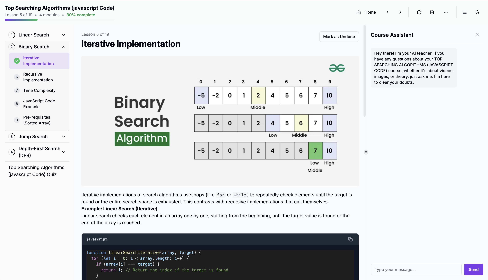

# AiCourse
 
## 🎥 Platform Demo

[](public/AI+Course.mp4)

*Click to watch the demo video*


## 🎥 Platform Demo

https://github.com/Ankitkj1999/AI_Course/assets/yourfilehere/AI+Course.mp4


## Deployment

### Automated Docker Build (GitHub Actions)

The project uses GitHub Actions for automated Docker image building and pushing to Docker Hub.

#### Workflow Configuration

- **Trigger**: Pushes to the `production` branch
- **Platforms**: Multi-platform build (linux/amd64, linux/arm64)
- **Image**: `ankitkj199/aicourse`
- **Tags**: Branch name, SHA, and `latest` for production branch

#### Required GitHub Secrets

Add these secrets to your GitHub repository settings:

- `DOCKER_USERNAME`: Your Docker Hub username
- `DOCKER_PASSWORD`: Your Docker Hub password or access token

#### Manual Deployment Scripts (Legacy)

For manual deployment, use these npm scripts:

```bash
# Build and push to Docker Hub
npm run docker:build:push [tag]

# Deploy on server from Docker Hub
npm run docker:deploy:production [tag]
```

#### Next Phase: EC2 Deployment

The next phase will involve pulling the Docker image on EC2 and running it automatically.

## Development

### Prerequisites

- Node.js 20+
- Docker
- Docker Compose

### Local Development

```bash
# Install dependencies
npm install

# Start development server
npm run dev

# Or start both server and client
npm run dev:full
```

### Docker Development

```bash
# Build and run with Docker Compose
npm run docker:up

# View logs
npm run docker:logs
- **Unsplash API** - Course cover images
- **YouTube API** - Video content integration
- **Multiple Payment APIs** - Stripe, PayPal, etc.

## 📋 Prerequisites

- **Node.js** (v16 or higher)
- **npm** or **yarn**
- **MongoDB** database
- **Google AI API** key

## 🛠️ Installation & Setup

### 🚀 Quick Start (Recommended)

#### Option 1: Local Development

1. **Clone the repository**

   ```bash
   git clone https://github.com/yourusername/aicourse.git
   cd aicourse
   ```

2. **Install dependencies**

   ```bash
   npm install
   ```

3. **Set up environment variables**

   ```bash
   cp server/.env.example server/.env
   ```

   Fill in your API keys and configuration in `server/.env`. See [Environment Variables](#-environment-variables) section below.

4. **Start the application**

   ```bash
   npm run dev:full
   ```

5. **Access the application**
   - Frontend: <http://localhost:8080>
   - Backend API: <http://localhost:5010>

#### Option 2: Docker Deployment

1. **Clone the repository**

   ```bash
   git clone https://github.com/yourusername/aicourse.git
   cd aicourse
   ```

2. **Set up environment variables**

   ```bash
   cp server/.env.example server/.env
   ```

   Fill in your API keys and configuration in `server/.env`.

3. **Start with Docker**

   ```bash
   npm run docker:up
   ```

4. **Access the application**
   - Application: <http://localhost:5010>
   - Health Check: <http://localhost:5010/health>

## 📁 Project Structure

```
aicourse/
├── src/                    # Frontend React application
│   ├── components/         # Reusable UI components
│   ├── pages/             # Page components
│   ├── hooks/             # Custom React hooks
│   ├── utils/             # Utility functions
│   └── constants.tsx      # App configuration
├── server/                # Backend Node.js application
│   ├── server.js          # Main server file
│   ├── .env.example       # Environment variables template
│   └── package.json       # Server dependencies
├── public/                # Static assets
├── .gitignore            # Git ignore rules
├── package.json          # Frontend dependencies
├── README.md             # This file
└── SETUP.md              # Detailed setup guide
```

## 🎯 Available Scripts

### Local Development

- `npm run dev:full` - Start both frontend and backend concurrently
- `npm run dev:clean` - Clean ports and start development (recommended)
- `npm run dev` - Start frontend only (Vite dev server)
- `npm run server` - Start backend only
- `npm run server:dev` - Start backend in development mode
- `npm run build` - Build frontend for production
- `npm run lint` - Run ESLint
- `npm run preview` - Preview production build

### Docker Commands

#### Local Development

- `npm run docker:up` - Build and start (foreground) → <http://localhost:5010>
- `npm run docker:up:detached` - Build and start (background)
- `npm run docker:down` - Stop and remove containers

#### Docker Hub Deployment

- `npm run docker:build:push [tag]` - Build and push to Docker Hub (default: latest)
- `npm run docker:build:production` - Build production image
- `npm run docker:deploy:production [tag]` - Deploy on server from Docker Hub (default: production)
- `npm run docker:up:hub` - Run from Docker Hub image

#### General Commands

- `npm run docker:build` - Build Docker images only
- `npm run docker:logs` - View container logs
- `npm run docker:restart` - Restart containers
- `npm run health` - Check application health status

### Log Monitoring Commands

- `tail -f server/logs/combined.log` - Monitor all logs in real-time
- `tail -f server/logs/error.log` - Monitor errors only
- `grep "LLM" server/logs/combined.log` - Filter LLM operations
- `grep "ERROR" server/logs/combined.log` - Find error entries
- `docker logs -f aicourse-app` - Monitor Docker container logs

## 🐳 Docker Deployment

### Prerequisites for Docker

- **Docker** (v20.0 or higher)
- **Docker Compose** (v2.0 or higher)

### Docker Commands Reference

```bash
# Start the application (builds if needed)
npm run docker:up

# Start in background (detached mode)
npm run docker:up:detached

# Stop the application
npm run docker:down

# View logs
npm run docker:logs

# Restart containers
npm run docker:restart

# Check health
npm run health

# Production deployment workflow
npm run docker:build:push v1.2.3        # Build and push with custom tag
npm run docker:deploy:production v1.2.3 # Deploy the same tag

# Or use default tags:
npm run docker:build:push production    # Build and push with 'production' tag
npm run docker:deploy:production production  # Deploy the 'production' tag
```

### Docker Configuration

- **Single container** for simplicity
- **Multi-stage build** for optimized production images
- **Health checks** for container monitoring
- **Volume mounting** for persistent logs
- **Port mapping**: 5010:5010
- **Docker Hub integration** for easy deployment

### Docker Environment

- **Base Image**: `node:20-alpine`
- **Working Directory**: `/app`
- **Exposed Port**: `5010`
- **Health Check**: `/health` endpoint
- **User**: Non-root user (`appuser`) for security

## 🔧 Configuration

### Frontend Configuration

Edit `src/constants.tsx` to configure:

- API endpoints
- Payment gateway settings
- Social login credentials
- Pricing plans
- Branding elements

### Backend Configuration

Edit `server/.env` to configure:

- Database connection
- API keys
- Email settings
- Payment gateway credentials

## 📊 Logging & Monitoring

AiCourse includes comprehensive logging for monitoring application performance, debugging issues, and tracking LLM operations.

### Log Files Location

All logs are stored in the `server/logs/` directory:

```
server/logs/
├── combined.log      # All application logs (info, warn, error)
├── error.log         # Error-level logs only
├── exceptions.log    # Uncaught exceptions
└── rejections.log    # Unhandled promise rejections
```

### Viewing Logs

#### Real-time Log Monitoring

```bash
# Watch all logs in real-time
tail -f server/logs/combined.log

# Watch only errors
tail -f server/logs/error.log

# Filter LLM-specific logs
tail -f server/logs/combined.log | grep "LLM"

# Filter by log level
tail -f server/logs/combined.log | grep "error\|warn"
```

#### Docker Log Monitoring

```bash
# View container logs
npm run docker:logs

# Follow container logs in real-time
docker logs -f aicourse-app

# View last 100 log entries
docker logs --tail 100 aicourse-app
```

### Log Structure

Logs are structured in JSON format with the following fields:

```json
{
  "level": "info",
  "message": "LLM request completed successfully",
  "timestamp": "2025-11-06 11:28:33:2833",
  "requestId": "req_1762408495723_kacod2bq3",
  "endpoint": "/api/generate",
  "tags": ["LLM", "REQUEST_SUCCESS"],
  "provider": "gemini",
  "duration": 1500,
  "userId": "user123"
}
```

### LLM Operation Logging

The application provides detailed logging for LLM operations:

#### Provider Selection & Fallback
- Provider selection logic and decisions
- Fallback provider usage when primary fails
- Provider availability and health status

#### Performance Metrics
- Request/response timing information
- LLM instance creation time
- Content generation duration
- Token usage statistics

#### Error Tracking
- Validation failures with context
- Provider-specific errors
- Fallback operation results

#### Log Tags for Filtering

Use these tags to filter specific operations:

```bash
# Service initialization
grep "SERVICE_INIT" server/logs/combined.log

# Provider selection
grep "PROVIDER_SELECTION" server/logs/combined.log

# Fallback operations
grep "FALLBACK" server/logs/combined.log

# Performance metrics
grep "PERFORMANCE" server/logs/combined.log

# Validation failures
grep "VALIDATION_FAILURE" server/logs/combined.log

# Health checks
grep "HEALTH_CHECK" server/logs/combined.log
```

### Log Analysis Examples

#### Find Recent Errors
```bash
# Last 50 error entries
tail -50 server/logs/error.log

# Errors from the last hour
grep "$(date '+%Y-%m-%d %H')" server/logs/error.log
```

#### Monitor LLM Performance
```bash
# Find slow requests (>5 seconds)
grep -E '"duration":[5-9][0-9]{3}|"duration":[1-9][0-9]{4}' server/logs/combined.log

# Provider fallback incidents
grep "PROVIDER_FALLBACK" server/logs/combined.log
```

#### Track User Activity
```bash
# Find logs for specific user
grep '"userId":"user123"' server/logs/combined.log

# Course generation requests
grep "COURSE.*REQUEST_SUCCESS" server/logs/combined.log
```

### Log Rotation

Logs are automatically managed by Winston with the following behavior:

- **Console Output**: Colored, human-readable format for development
- **File Output**: JSON format for parsing and analysis
- **Error Separation**: Errors are logged to both combined.log and error.log
- **Exception Handling**: Uncaught exceptions and rejections are logged separately

### Production Log Management

For production environments, consider:

1. **Log Rotation**: Implement log rotation to prevent disk space issues
2. **External Monitoring**: Use tools like ELK Stack, Splunk, or CloudWatch
3. **Alerting**: Set up alerts for error patterns or performance degradation
4. **Retention**: Configure appropriate log retention policies

#### Example Log Rotation Setup

```bash
# Install logrotate (Ubuntu/Debian)
sudo apt-get install logrotate

# Create logrotate configuration
sudo nano /etc/logrotate.d/aicourse
```

```
/path/to/aicourse/server/logs/*.log {
    daily
    missingok
    rotate 30
    compress
    delaycompress
    notifempty
    copytruncate
}
```

## 💰 Pricing Plans

- **Free Plan**: Basic course generation (limited)
- **Monthly Plan**: $9/month - Full features
- **Yearly Plan**: $99/year - Full features with discount

## 🔐 Environment Variables

Key environment variables needed:

```env
# Required
MONGODB_URI=your_mongodb_connection_string
API_KEY=your_google_ai_api_key
EMAIL=your_gmail_address
PASSWORD=your_gmail_app_password

# Optional (for full functionality)
STRIPE_SECRET_KEY=your_stripe_key
PAYPAL_CLIENT_ID=your_paypal_client_id
UNSPLASH_ACCESS_KEY=your_unsplash_key
```

See [SETUP.md](SETUP.md) for complete configuration guide.

## 🤝 Contributing

1. Fork the repository
2. Create a feature branch (`git checkout -b feature/amazing-feature`)
3. Commit your changes (`git commit -m 'Add amazing feature'`)
4. Push to the branch (`git push origin feature/amazing-feature`)
5. Open a Pull Request

## 📝 License

This project is licensed under the MIT License - see the [LICENSE](LICENSE) file for details.

## 📚 Documentation

- 🚀 **[Development Guide](DEVELOPMENT.md)** - Quick start for developers
- 🐳 **[Docker Guide](DOCKER.md)** - Docker deployment instructions
- 🔧 **[Setup Guide](SETUP.md)** - Detailed configuration guide

## 🆘 Support

- 📧 Email: <ankit.k.j@gmail.com>
- 🐛 Issues: [GitHub Issues](https://github.com/ankitkj1999/aicourse/issues)
- 📖 Documentation: See guides above

## 🙏 Acknowledgments

- **Google Generative AI** for powerful content generation
- **Radix UI** for accessible components
- **Tailwind CSS** for styling system
- **Unsplash** for beautiful course images

---

Made with ❤️ by [Ankit](https://github.com/ankitkj1999)
