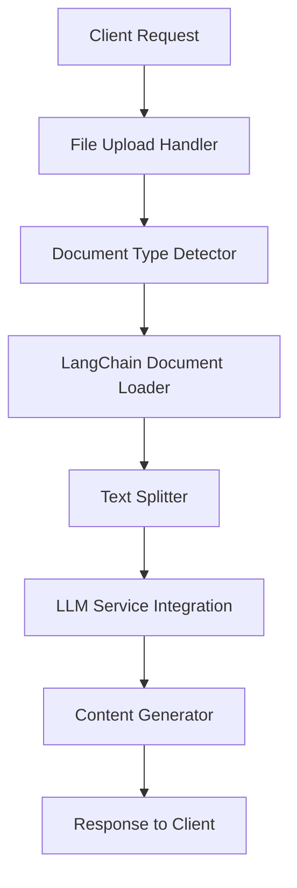

# Document Context Generation Feature Plan

## Overview

This plan outlines the implementation of document-based content generation for the AI Course Generator, enabling users to create courses, quizzes, flashcards, and guides from PDF files, DOCX documents, plain text, and web URLs using the existing LangChain infrastructure.

## Current State Analysis

### ✅ Existing Infrastructure
- **LangChain Integration**: Already configured with `@langchain/core`, `@langchain/google-genai`, `@langchain/openai`
- **LLM Service**: Multi-provider LLM service (`llmService`) with fallback support
- **Content Types**: Course, Quiz, Flashcard, Guide generation
- **File Structure**: Well-organized server-client architecture
- **Authentication**: JWT-based user authentication system

### 🔧 Required Additions
- Document loading capabilities
- File upload handling
- Text processing and chunking
- Web scraping functionality

## Feature Requirements

### 1. Document Input Methods
- **File Upload**: PDF, DOCX, TXT files
- **Direct Text Input**: Plain text areas
- **Web URLs**: Article and blog post scraping

### 2. Processing Capabilities
- **Text Extraction**: From various document formats
- **Smart Chunking**: Context-aware text segmentation
- **Content Analysis**: Basic topic extraction

### 3. Output Generation
- **Courses**: Structured learning content
- **Quizzes**: Interactive assessment questions
- **Flashcards**: Quick review cards
- **Guides**: Comprehensive study materials

## Implementation Plan

### Phase 1: Foundation Setup

#### Dependencies Installation
```json
{
  "langchain": "^0.1.0",
  "@langchain/community": "^0.0.20",
  "pdf-parse": "^1.1.1",
  "mammoth": "^1.6.0",
  "cheerio": "^1.0.0-rc.12",
  "multer": "^1.4.5-lts.1"
}
```

#### File Upload Infrastructure
- **Middleware Setup**: Multer configuration for multipart/form-data
- **File Validation**: Size limits, type checking, security scanning
- **Storage Strategy**: Temporary file storage with cleanup
- **Error Handling**: Graceful failure handling

#### API Endpoints Structure
```
POST /api/document/upload
POST /api/document/extract-text
POST /api/course/from-document
POST /api/quiz/from-document
POST /api/flashcard/from-document
POST /api/guide/from-document
```

### Phase 2: Document Processing

#### LangChain Integration
```javascript
// Document Loaders
- PDFLoader: PDF text extraction
- TextLoader: Plain text files
- MammothLoader: DOCX processing
- WebBaseLoader: URL content extraction

// Text Processing
- RecursiveCharacterTextSplitter: Smart chunking
- Token counting and optimization
```

#### Content Extraction Pipeline
1. **Document Upload** → Temporary storage
2. **Format Detection** → PDF/DOCX/TXT/URL
3. **Text Extraction** → LangChain loaders
4. **Content Analysis** → Basic topic identification
5. **Smart Chunking** → Context-aware segmentation

### Phase 3: Enhanced Context (Optional)

#### Basic Embeddings Support
```javascript
// Optional: For improved context handling
- OpenAI embeddings via existing llmService
- Simple vector storage for semantic search
```

*Note: This phase can be implemented later for better performance with large documents*

### Phase 4: Frontend Integration

#### UI Components
- **Document Upload Component**: Drag-and-drop file upload
- **URL Input Form**: Web content extraction interface
- **Text Editor**: Direct text input area
- **Preview Panel**: Extracted content visualization
- **Processing Status**: Real-time processing feedback

#### User Experience Flow
```
1. Select Input Method (File/URL/Text)
2. Upload/Input Content
3. Preview Extracted Text
4. Configure Generation Settings
5. Select Output Type (Course/Quiz/Flashcard/Guide)
6. Generate Content
7. Review and Edit Results
```

### Phase 5: Testing & Deployment

#### Basic Testing
- **Unit Tests**: Core document processing functions
- **Integration Tests**: API endpoints
- **Security Tests**: File upload validation
- **User Acceptance**: Basic workflow testing

#### Deployment
- **Staged Rollout**: Feature flag controlled release
- **Monitoring**: Basic error tracking and performance monitoring

## Technical Architecture

### Server-Side Architecture


### Database Schema Extensions
```javascript
// Document Processing Records
const documentRecord = {
  _id: ObjectId,
  userId: String,
  filename: String,
  fileType: String, // 'pdf', 'docx', 'txt', 'url'
  fileSize: Number,
  extractionStatus: String, // 'pending', 'processing', 'completed', 'failed'
  extractedText: String,
  createdAt: Date,
  expiresAt: Date // Auto-cleanup
};

// Content Generation Records
const generationRecord = {
  _id: ObjectId,
  userId: String,
  documentId: String,
  contentType: String, // 'course', 'quiz', 'flashcard', 'guide'
  prompt: String,
  generatedContent: String,
  processingTime: Number,
  createdAt: Date
};
```

## Security Considerations

### File Upload Security
- **File Type Validation**: Strict MIME type checking
- **Size Limits**: Prevent memory exhaustion
- **Storage Cleanup**: Automatic temporary file deletion
- **Input Sanitization**: XSS prevention

## Error Handling Strategy

### Common Failure Scenarios
1. **Unsupported File Format**: Graceful degradation with suggestions
2. **Large File Size**: Chunked processing with progress updates
3. **Network Issues**: Retry mechanisms for URL processing
4. **LLM Service Failure**: Fallback to alternative providers

### User Communication
- **Progress Indicators**: Real-time status updates
- **Error Messages**: Clear, actionable feedback
- **Recovery Options**: Alternative processing methods

## Success Criteria

### Technical Success
- ✅ Successful integration with existing LangChain setup
- ✅ Support for all target document formats
- ✅ Sub-30 second processing for typical documents
- ✅ 99%+ processing success rate

### User Success
- ✅ Intuitive document upload workflow
- ✅ High-quality generated content
- ✅ Seamless integration with existing features
- ✅ Positive user feedback and engagement

### Business Success
- ✅ Increased feature adoption
- ✅ Enhanced user retention
- ✅ Competitive advantage in document processing