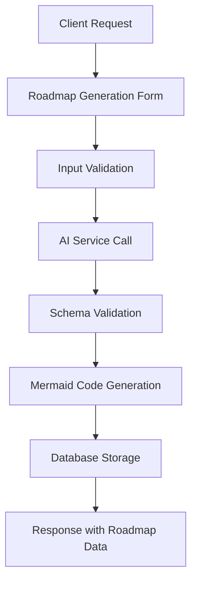
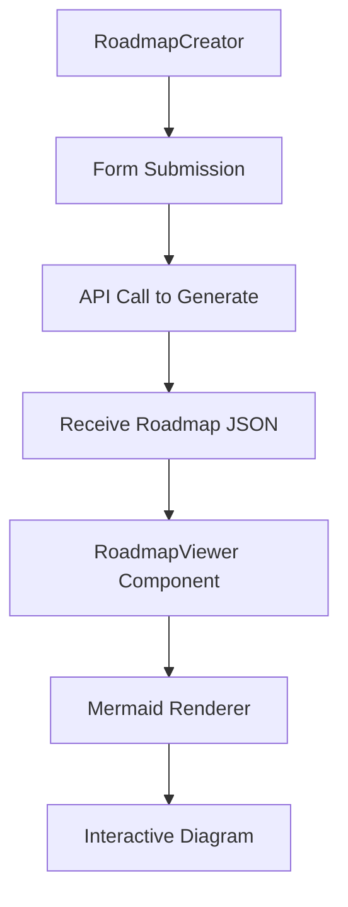

# Roadmap Generation Feature Plan

## Overview

This plan outlines the implementation of AI-powered roadmap generation for the AI Course Generator, enabling users to create visual learning paths inspired by roadmap.sh. The feature will support general learning journeys from beginner to advanced levels, as well as specific exam preparation roadmaps, with branching capabilities and rich metadata support.

## Current State Analysis

### ✅ Existing Infrastructure
- **LangChain Integration**: Already configured with multi-provider LLM support
- **Content Types**: Course, Quiz, Flashcard, Guide generation
- **Frontend Components**: React-based UI with dashboard integration
- **Database**: MongoDB with existing content schemas
- **Authentication**: JWT-based user system

### 🔧 Required Additions
- Roadmap schema definition (nodes, edges, metadata)
- Mermaid diagram rendering for visualization
- AI prompt engineering for structured roadmap generation
- Frontend components for roadmap creation and viewing

## Feature Requirements

### 1. Roadmap Generation
- **Topic Input**: User specifies topic (e.g., "Web Development", "Data Science")
- **Level Selection**: Beginner, Intermediate, Advanced
- **Type Options**: General learning path or exam preparation
- **AI Generation**: Structured roadmap with nodes and connections

### 2. Roadmap Structure
- **Nodes**: Learning topics/concepts with descriptions and resources
- **Edges**: Progression arrows showing learning sequence
- **Branching**: Support for specialization paths (e.g., Frontend vs Backend)
- **Levels**: Hierarchical organization (Beginner → Intermediate → Advanced)

### 3. Metadata Support
- **Context**: Learning level, purpose, target audience
- **Documents**: Reference to source materials (PDFs, articles)
- **References**: External links to resources, documentation, courses

### 4. Visualization
- **Mermaid Rendering**: Use Mermaid.js for flowchart visualization
- **Interactive Display**: Clickable nodes with details
- **Responsive Design**: Works on desktop and mobile

### 5. Integration
- **Dashboard**: Add to existing content creation workflow
- **Sharing**: Public roadmaps with SEO-friendly URLs
- **Management**: CRUD operations for user roadmaps

## Implementation Plan

### Phase 1: Foundation Setup

#### Dependencies Installation
```json
{
  "mermaid": "^10.6.1",
  "@types/mermaid": "^9.3.0"
}
```

#### Database Schema
```javascript
const roadmapSchema = {
  _id: ObjectId,
  userId: String,
  title: String,
  topic: String,
  level: String, // 'beginner', 'intermediate', 'advanced'
  type: String, // 'general', 'exam_prep'
  nodes: [{
    id: String,
    label: String,
    level: String,
    category: String,
    description: String,
    references: [String] // URLs
  }],
  edges: [{
    from: String,
    to: String,
    type: String // 'progression', 'branch'
  }],
  metadata: {
    context: String,
    documents: [String], // file references
    references: [String] // external links
  },
  mermaidCode: String,
  slug: String,
  createdAt: Date,
  isPublic: Boolean
};
```

#### API Endpoints Structure
```
POST /api/roadmap/generate
GET /api/roadmaps
GET /api/roadmap/:id
PUT /api/roadmap/:id
DELETE /api/roadmap/:id
GET /api/roadmap/slug/:slug
```

### Phase 2: AI Integration

#### Roadmap Generation Pipeline
1. **Input Processing**: Parse topic, level, type
2. **Prompt Engineering**: Structured prompts for consistent output
3. **Schema Validation**: Ensure generated roadmap follows node/edge structure
4. **Mermaid Conversion**: Transform JSON to Mermaid flowchart syntax

#### AI Prompt Structure
```javascript
const roadmapPrompt = `
Generate a learning roadmap for: ${topic}
Level: ${level}
Type: ${type}

Return JSON with:
- nodes: array of {id, label, level, category, description, references}
- edges: array of {from, to, type}
- metadata: {context, references}

Ensure branching for specializations where appropriate.
`;
```

### Phase 3: Frontend Integration

#### UI Components
- **RoadmapCreator**: Form for topic input and generation
- **RoadmapViewer**: Interactive Mermaid diagram display
- **RoadmapList**: Dashboard list of user roadmaps
- **RoadmapEditor**: Basic editing capabilities

#### User Experience Flow
```
1. Navigate to "Create Roadmap" in dashboard
2. Enter topic, select level and type
3. Click "Generate Roadmap with AI"
4. View generated roadmap with Mermaid visualization
5. Edit metadata and references if needed
6. Save and share roadmap
```

### Phase 4: Testing & Deployment

#### Testing Strategy
- **Unit Tests**: Roadmap schema validation, Mermaid generation
- **Integration Tests**: API endpoints, AI generation pipeline
- **UI Tests**: Component rendering, interactivity
- **User Acceptance**: End-to-end roadmap creation flow

#### Deployment
- **Feature Flag**: Controlled rollout
- **Monitoring**: Track generation success rates, user engagement
- **Performance**: Optimize Mermaid rendering for large roadmaps

## Technical Architecture

### Server-Side Architecture


### Frontend Architecture


## Security Considerations

### Input Validation
- **Prompt Sanitization**: Prevent injection attacks in AI prompts
- **Schema Enforcement**: Validate generated roadmap structure
- **Size Limits**: Prevent overly complex roadmaps

### Data Protection
- **User Isolation**: Roadmaps tied to authenticated users
- **Public Sharing**: Controlled visibility settings
- **Content Moderation**: Basic checks for inappropriate content

## Error Handling Strategy

### Common Failure Scenarios
1. **AI Generation Failure**: Fallback to simpler roadmap structure
2. **Mermaid Rendering Error**: Display text-based alternative
3. **Schema Validation Error**: Retry with corrected prompt
4. **Large Roadmap**: Chunk processing or simplification

### User Communication
- **Loading States**: Progress indicators during generation
- **Error Messages**: Clear feedback with retry options
- **Fallback Display**: Text-based roadmap when visualization fails

## Success Criteria

### Technical Success
- ✅ AI generates valid roadmap schemas in <30 seconds
- ✅ Mermaid diagrams render correctly for 95% of roadmaps
- ✅ API endpoints handle 99% of requests successfully
- ✅ Database queries perform under 500ms

### User Success
- ✅ Intuitive roadmap creation workflow
- ✅ Clear, useful learning paths generated
- ✅ Interactive visualization enhances learning
- ✅ Seamless integration with existing features

### Business Success
- ✅ 20% increase in user engagement with learning content
- ✅ Positive feedback on roadmap quality
- ✅ Competitive differentiation in learning tools
- ✅ Increased user retention through comprehensive learning paths

## Industry Standards Alignment

### Inspired by roadmap.sh
- **Visual Structure**: Node-based progression with clear levels
- **Branching Logic**: Support for multiple specialization paths
- **Resource Integration**: Links to external learning materials
- **Progressive Learning**: From fundamentals to advanced topics

### Best Practices
- **Accessibility**: Alt text for diagrams, keyboard navigation
- **Mobile Responsive**: Diagrams scale appropriately
- **SEO Friendly**: Public roadmaps discoverable via search
- **Data Portability**: Export roadmaps as JSON or images