# Server.js Dependencies Map

## Dependency Flow Diagram

```mermaid
graph TB
    Server[server.js] --> Routes[Route Files]
    Server --> Services[Services Layer]
    Server --> Models[Data Models]
    Server --> Middleware[Middleware]
    Server --> Utils[Utilities]
    
    Routes --> |Authentication| Auth[authRoutes.js ✅]
    Routes --> |Admin Ops| Admin[adminRoutes.js ✅]
    Routes --> |Payments| Payment[paymentRoutes.js ✅]
    Routes --> |LLM/AI| LLM[llmRoutes.js ✅]
    Routes --> |Courses| Course[courseRoutes.js ✅]
    Routes --> |Learning| Learning[learningRoutes.js ❌]
    Routes --> |Documents| Doc[documentRoutes.js ❌]
    Routes --> |Public| Public[publicContentRoutes.js ✅]
    Routes --> |Content| Content[contentRoutes.js ✅]
    Routes --> |Users| User[userRoutes.js ✅]
    Routes --> |Utils| Util[utilityRoutes.js ✅]
    
    Services --> LLMSvc[llmService]
    Services --> CourseSvc[courseGenerationService]
    Services --> SectionSvc[sectionService]
    Services --> ContentSvc[contentConverter]
    Services --> DocSvc[documentExtraction]
    
    Models --> CoreModels[Core Models]
    Models --> LearningModels[Learning Models]
    Models --> UserModels[User Models]
    
    CoreModels --> CourseModel[Course]
    CoreModels --> SectionModel[Section]
    CoreModels --> LanguageModel[Language]
    
    LearningModels --> QuizModel[Quiz]
    LearningModels --> FlashModel[Flashcard]
    LearningModels --> GuideModel[Guide]
    LearningModels --> NotesModel[Notes]
    LearningModels --> ExamModel[Exam]
    
    UserModels --> UserModel[User]
    UserModels --> AdminModel[Admin]
    UserModels --> SubModel[Subscription]
    
    Middleware --> AuthMid[requireAuth]
    Middleware --> OptAuth[optionalAuth]
    Middleware --> AdminMid[requireAdmin]
    Middleware --> Upload[uploadSingle]
    
    Utils --> Logger[logger]
    Utils --> Unsplash[unsplash]
    Utils --> Slug[generateUniqueSlug]
    Utils --> SafeAccess[safeGet/safeGetFirst]
    
    style Auth fill:#90EE90
    style Admin fill:#90EE90
    style Payment fill:#90EE90
    style LLM fill:#90EE90
    style Content fill:#90EE90
    style User fill:#90EE90
    style Util fill:#90EE90
    style Course fill:#90EE90
    style Learning fill:#FF6B6B
    style Doc fill:#FF6B6B
    style Public fill:#FF6B6B
```



## Legend
- ✅ **Green (Complete)**: Fully migrated, working independently
- ⚠️ **Yellow (Partial)**: Partially migrated, needs consolidation
- ❌ **Red (Pending)**: Not yet migrated, needs creation/completion

---

## Detailed Dependency Matrix

### 1. Learning Routes Dependencies

| Dependency | Type | Used By | Critical |
|------------|------|---------|----------|
| `Quiz` model | Model | Quiz CRUD | ✅ Yes |
| `Flashcard` model | Model | Flashcard CRUD | ✅ Yes |
| `Guide` model | Model | Guide CRUD | ✅ Yes |
| `Notes` model | Model | Notes operations | ✅ Yes |
| `Exam` model | Model | Exam generation | ✅ Yes |
| `llmService` | Service | Content generation | ✅ Yes |
| `logger` | Utility | Logging | ✅ Yes |
| `requireAuth` | Middleware | Authentication | ✅ Yes |
| `optionalAuth` | Middleware | Optional auth | ⚠️ Maybe |
| `unsplash` | Utility | Image search | ⚠️ Maybe |
| `generateUniqueSlug` | Utility | Slug generation | ✅ Yes |

**Injection Pattern Required**: Yes (see llmRoutes.js for reference)

---

### 2. Document Routes Dependencies

| Dependency | Type | Used By | Critical |
|------------|------|---------|----------|
| `DocumentProcessing` model | Model | Document tracking | ✅ Yes |
| `Course` model | Model | Course from doc | ✅ Yes |
| `Quiz` model | Model | Quiz from doc | ✅ Yes |
| `Flashcard` model | Model | Flashcard from doc | ✅ Yes |
| `Guide` model | Model | Guide from doc | ✅ Yes |
| `Language` model | Model | Language tracking | ⚠️ Maybe |
| `llmService` | Service | Content generation | ✅ Yes |
| `unsplash` | Utility | Course images | ⚠️ Maybe |
| `requireAuth` | Middleware | Authentication | ✅ Yes |
| `uploadSingle` | Middleware | File upload | ✅ Yes |
| `logger` | Utility | Logging | ✅ Yes |
| `generateUniqueSlug` | Utility | Slug generation | ✅ Yes |
| `extractTitleFromContent` | Utility | Title extraction | ⚠️ Maybe |
| `cleanupFile` | Utility | File cleanup | ✅ Yes |

**Injection Pattern Required**: Yes (complex dependencies)

---

### 3. Public Content Routes Dependencies

| Dependency | Type | Used By | Critical |
|------------|------|---------|----------|
| `Course` model | Model | Public courses | ✅ Yes |
| `Quiz` model | Model | Public quizzes | ✅ Yes |
| `Flashcard` model | Model | Public flashcards | ✅ Yes |
| `Guide` model | Model | Public guides | ✅ Yes |
| `User` model | Model | Owner info | ⚠️ Maybe |
| `requireAuth` | Middleware | For fork/visibility | ✅ Yes |
| `optionalAuth` | Middleware | Public viewing | ✅ Yes |
| `logger` | Utility | Logging | ✅ Yes |
| `generateUniqueSlug` | Utility | Fork slugs | ✅ Yes |

**Injection Pattern Required**: Maybe (simpler dependencies)

---

### 4. Course Routes Dependencies (Consolidation)

| Dependency | Type | Used By | Critical |
|------------|------|---------|----------|
| `Course` model | Model | All operations | ✅ Yes |
| `Section` model | Model | Section-based arch | ✅ Yes |
| `Language` model | Model | Language tracking | ✅ Yes |
| `CourseGenerationService` | Service | Course creation | ✅ Yes |
| `SectionService` | Service | Section operations | ✅ Yes |
| `ContentConverter` | Service | Format conversion | ⚠️ Maybe |
| `llmService` | Service | AI generation | ⚠️ Maybe |
| `unsplash` | Utility | Course images | ✅ Yes |
| `requireAuth` | Middleware | Authentication | ✅ Yes |
| `optionalAuth` | Middleware | Public viewing | ✅ Yes |
| `logger` | Utility | Logging | ✅ Yes |
| `generateUniqueSlug` | Utility | Slug generation | ✅ Yes |
| `extractTitleFromContent` | Utility | Title extraction | ⚠️ Maybe |
| `generateCourseSEO` | Utility | SEO data | ⚠️ Maybe |
| `safeGet/safeGetFirst/safeGetArray` | Utility | Safe access | ✅ Yes |

**Injection Pattern Required**: Recommended (many dependencies)

---

## Shared Service Contracts

### llmService Interface
```javascript
{
  generateContent(prompt, options): Promise<Result>
  generateContentAuto(prompt, options): Promise<Result>
  getProviders(): Array<Provider>
  getStatus(): Status
  checkProviderHealth(providerId): Promise<Health>
  checkAllProvidersHealth(): Promise<Array<Health>>
}
```

**Used by**: Learning routes, Document routes, Course routes, LLM routes

---

### CourseGenerationService Interface
```javascript
{
  createCourseFromGeneration(data, userId): Promise<Course>
  convertLegacyCourse(courseId, userId): Promise<Course>
  isNewArchitecture(course): Boolean
  isLegacyCourse(course): Boolean
  getGenerationStats(courseId): Promise<Stats>
}
```

**Used by**: Course routes, Document routes

---

### SectionService Interface
```javascript
{
  getSection(sectionId): Promise<Section>
  updateSection(sectionId, data): Promise<Section>
  createSection(courseId, data): Promise<Section>
  deleteSection(sectionId): Promise<Boolean>
}
```

**Used by**: Course routes, Content routes, LLM routes

---

### DocumentProcessing Interface
```javascript
{
  extractDocument(options): Promise<Result>
  extractFromURL(url, userId): Promise<Result>
  getProcessingStatus(id): Promise<Status>
  getExtractedText(id): Promise<String>
}
```

**Used by**: Document routes

---

## Injection Strategy Recommendations

### Pattern 1: Simple Direct Injection (Best for 1-5 dependencies)
```javascript
import express from 'express';
const router = express.Router();

// Direct imports for simple cases
import { requireAuth } from '../middleware/authMiddleware.js';
import logger from '../utils/logger.js';
import { Quiz } from '../models/index.js';

// Use directly
router.post('/api/quiz', requireAuth, async (req, res) => {
  // Implementation
});

export default router;
```

**Recommended for**: userRoutes, utilityRoutes, publicContentRoutes

---

### Pattern 2: Dependency Injection (Best for 5+ dependencies)
```javascript
import express from 'express';
const router = express.Router();

// Dependencies to be injected
let requireAuth, logger, llmService, Quiz, Flashcard, Guide;

// Initialize function
export function initializeRoutes(deps) {
  requireAuth = deps.requireAuth;
  logger = deps.logger;
  llmService = deps.llmService;
  Quiz = deps.Quiz;
  Flashcard = deps.Flashcard;
  Guide = deps.Guide;
}

router.post('/api/quiz', requireAuth, async (req, res) => {
  // Use injected dependencies
});

export default router;
```

**Recommended for**: learningRoutes, documentRoutes, courseRoutes, llmRoutes

**In server.js**:
```javascript
import learningRoutes, { initializeLearningRoutes } from './routes/learningRoutes.js';

// Initialize with dependencies
initializeLearningRoutes({
  requireAuth,
  logger,
  llmService,
  Quiz,
  Flashcard,
  Guide,
  Notes,
  Exam,
  unsplash,
  generateUniqueSlug
});

// Mount routes
app.use('/api', learningRoutes);
```

---

## Migration Order (by Complexity)

### Phase 1: Low Complexity (Start Here)
1. **publicContentRoutes.js** (NEW) ✅ COMPLETE
   - Few dependencies
   - Clear boundaries
   - Low risk

### Phase 2: Medium Complexity
2. **learningRoutes.js** (COMPLETE)
   - Moderate dependencies
   - Independent operations
   - Medium risk

3. **Miscellaneous routes** (DISTRIBUTE)
   - Simple CRUD
   - Existing targets
   - Low risk

### Phase 3: High Complexity (Careful!)
4. **documentRoutes.js** (NEW)
   - Complex dependencies
   - Async operations
   - Medium-high risk

5. **courseRoutes.js** (CONSOLIDATE) ✅ COMPLETE
   - All course routes consolidated
   - Legacy routes removed from server.js
   - Dependency injection pattern implemented

---

## Testing Strategy per Route File

### Unit Tests Required
- Each route handler function
- Dependency injection initialization
- Error handling paths
- Authentication/authorization

### Integration Tests Required
- Full request/response cycle
- Database operations
- External API calls (Unsplash, LLM)
- File upload/cleanup

### Backward Compatibility Tests
- Old endpoint redirects
- Response format consistency
- Status code compatibility
- Header compatibility

---

## Circular Dependency Prevention

### Common Pitfalls
1. **Route → Service → Model → Route** ❌
   - Solution: Keep routes at top level

2. **Service → Service → Service** ❌
   - Solution: Extract shared utilities

3. **Model → Service** ❌
   - Solution: Use dependency injection

### Safe Patterns
1. **Route → Service → Model** ✅
2. **Route → Middleware → Service** ✅
3. **Service → Utility → Model** ✅

---

## Performance Considerations

### Current Issues in server.js
1. **Monolithic file** - Slow startup time
2. **Mixed concerns** - Hard to optimize
3. **Duplicate code** - Memory overhead

### Expected Improvements
1. **Modular loading** - Faster startup
2. **Code splitting** - Better memory
3. **Parallel execution** - Better throughput
4. **Easier caching** - Better performance

### Monitoring Points
- Response time per route
- Memory usage per module
- Database query count
- External API calls

---

## Security Checklist

### Per Route File
- [ ] Authentication properly enforced
- [ ] Authorization checked (ownership)
- [ ] Input validation on all parameters
- [ ] SQL injection prevention
- [ ] XSS prevention in responses
- [ ] Rate limiting configured
- [ ] File upload restrictions (size, type)
- [ ] Sensitive data not logged

### Cross-Cutting Concerns
- [ ] CORS configured correctly
- [ ] HTTPS enforced in production
- [ ] API key validation
- [ ] Session management secure
- [ ] Error messages don't leak info

---

## Documentation Requirements

### Per Route File
1. **Route documentation**
   - HTTP method and path
   - Request parameters
   - Response format
   - Error codes
   - Examples

2. **Dependency documentation**
   - What needs to be injected
   - Why each dependency is needed
   - Initialization order

3. **Testing documentation**
   - How to run tests
   - Test coverage requirements
   - Mock requirements

### API Reference Updates
- Update OpenAPI/Swagger spec
- Update Postman collection
- Update frontend integration guide
- Update deployment guide
